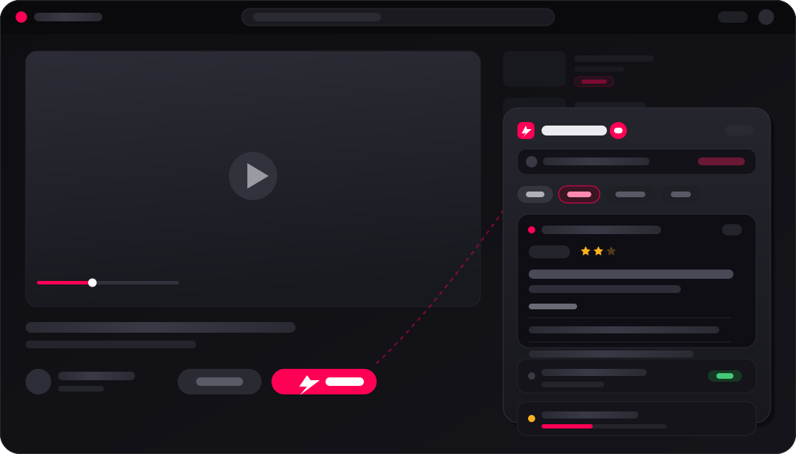

# ⚡ TL;DW - YouTube AI Summarizer

**TL;DW** (*Too Long; Didn't Watch*) is a fast, lightweight Chrome Extension (Manifest V3) that summarizes YouTube videos in seconds. It uses **Clipscript.uk** for high-speed transcription and your choice of **AI Provider** (Google Gemini, OpenAI, Groq, Anthropic, or OpenRouter) to generate summaries in a shared queue on YouTube.

<p align="center">
  
</p>

<p align="center"><sub>Watch page → <code>⚡ Summarize</code> beside Subscribe → shared queue with unread badge, stars, and key points. Skeleton only — no real copy.</sub></p>

---

## ✨ Features

- ⚡ **Unified Summary Queue**: One top-right `TL;DW Queue` for watch pages and feed cards. On a watch page, `⚡ Summarize` sits next to Subscribe; on Home/Search/Recommendations it sits under thumbnails. Click queues the video, opens the sheet when it finishes, and lets you filter All / New / Running / Done, remove items, retry failures, and Clear done.
- 🔴 **Unread Badge**: Finished summaries stay unread until you open them. The extension action badge and queue toggle show the unread count only — not total queue size.
- ⭐ **Answer-First Summaries**: Classifies the thumbnail + title in parallel with transcript fetch to work out what the video promised, then leads with the answer and rates delivery on a 1–3 star scale. Vlogs, music, comedy, and other “no promise” videos get a plain summary. Toggle off in Settings to skip the image call.
- ⏱️ **Time Saved Counter**: Adds up the length of every video you summarized instead of watching, minus an estimate of reading time (230 wpm). Shown at the top of the Summary Queue, in the popup, and in Settings (resettable). Counted once per video; survives clearing the summary cache.
- 🎚️ **5-Level Detail Slider**: Tailor summary depth on the fly:
  - **Level 1 (TL;DR)**: 1-sentence executive summary
  - **Level 2 (Short)**: 2–3 concise sentences
  - **Level 3 (Standard)**: 1 balanced paragraph
  - **Level 4 (Detailed)**: 2–3 thorough paragraphs
  - **Level 5 (Deep Dive)**: Full topic breakdown
- 📑 **Multiple Formats**: Switch between **Paragraph Prose** (📝), **Bullet Points** (📑), and **Key Takeaways** (💡).
- 🎨 **Theme-Aware UI**: Dark/light surfaces that track YouTube, Apple SF Pro typography, glassmorphism, and markdown (`**bold**`, lists, code blocks). Answer-first cards use a meta row (label + stars), Key points body, and an overflow menu for secondary actions.
- 🌐 **Smart Translation & Language Control**: Extracts native video transcripts (Arabic, English, French, etc.) and translates summaries to English or your target language.
- 🤖 **Multiple AI Providers**:
  - **Google Gemini Flash Latest** *(Recommended — Free API key from Google AI Studio; `gemini-flash-latest` / 2.5 Flash)*
  - **OpenAI GPT-4o-mini**
  - **Groq (Llama 3.3 70B)**
  - **Anthropic Claude Haiku 4.5**
  - **OpenRouter** *(~google/gemini-flash-latest)*
- 📊 **Granular Progress**: Queue items show stage-level progress (transcript → classify → summarize) instead of a single spinner.
- ⚡ **Instant Caching**: Saves generated summaries in extension storage to prevent redundant API calls and save quota.
- 📄 **Full Transcript Inspector**: View the raw transcript in a collapsible inspector whenever you want the source text.
- 📓 **Optional Obsidian Export**: Bookmark a full summary or highlight selected text into `TLDW/{video title}.md` (opens the note for your own comments). Highlights wrap the selection in-place with `==…==`; notes include a `[[YYYY-MM-DD]]` date link. Hidden until a vault name is set.

---

## 🚀 Quick Setup & Installation

### 1. Download / Clone Repository
```bash
git clone https://github.com/yazinsai/tldw.git
```

### 2. Load Extension in Chrome
1. Open Google Chrome and navigate to `chrome://extensions/`.
2. Toggle on **Developer mode** in the top-right corner.
3. Click **Load unpacked**.
4. Select the `tldw` repository folder.
5. The **TL;DW** icon ⚡ will appear in your Chrome toolbar!

### 3. Configure API Keys
1. Click the ⚡ extension icon in your Chrome toolbar and select **⚙️ Settings** (or go to `chrome://extensions` → **Details** → **Extension options**).
2. Enter your **Clipscript API Key** (get one at [clipscript.uk](https://clipscript.uk)). Click **Test Key** to verify.
3. Select your **AI Provider** (e.g. Google Gemini) and paste your API key (get a free Gemini key at [Google AI Studio](https://aistudio.google.com)).
4. Optionally enable **Obsidian Export** and enter your exact vault name.
5. Click **Save Settings**.

---

## 💻 Usage

- **Watch Page**: Open any YouTube video. Click `⚡ Summarize` next to Subscribe — it queues the video and the shared `TL;DW Queue` sheet opens when the summary finishes (or reopen it from the floating tray).
- **Feed Cards**: On Home, Search, or recommendations, click `⚡ Summarize` under a card to add it to the same queue. Filter, remove, retry, or Clear done from the timeline.
- **Extension Popup**: Click the toolbar icon on an active YouTube tab to check cache, summarize with custom level/format, see time saved, or jump to Settings.
- **Obsidian (optional)**: In Settings, enable Save to Obsidian and enter your vault name. On a finished summary, bookmark the full note or select text and **Save highlight**. Notes land at `TLDW/{video title}.md`; long notes fall back to clipboard when the `obsidian://` URI would be too long.

---

## 📁 Repository Structure

```
tldw/
├── manifest.json          # Manifest V3 extension configuration
├── background.js          # Service worker (Clipscript, queue, cache, time saved, Obsidian)
├── summarizer.js          # AI providers (Gemini, OpenAI, Groq, Anthropic, OpenRouter)
├── summary-prompts.js     # Prompt variants, per-video-type profiles, answer block contract
├── summary-progress.js    # Stage labels for queue progress UI
├── summary-queue.js       # Queue item model, unread helpers, storage key
├── summary-answer.js      # Parses/formats the answer block for copy/export
├── video-classifier.js    # Thumbnail + title classification (type, promise, hook)
├── time-saved.js          # Lifetime "video you didn't watch" ledger
├── obsidian-export.js     # Markdown note + highlight URI planning
├── content.js             # YouTube inject: Summarize buttons, queue tray/sheet
├── content.css            # Injected YouTube UI styles
├── popup.html/.js/.css    # Toolbar popup
├── options.html/.js/.css  # Settings page
├── icons/                 # 16 / 32 / 48 / 128px
├── store-assets/          # Store listing assets + README hero skeleton
│   └── hero-skeleton.svg  # Skeleton mock of watch page + Summary Queue
├── CHROMEWEBSTORE.md      # Store listing copy & review notes
├── PRIVACY.md             # Privacy policy
└── README.md
```

---

## 🆕 Since first release

Shipped after the initial `e24d6f5` release:

- Unified watch + feed into one Summary Queue (button next to Subscribe; no separate watch panel)
- Answer-first summaries with thumbnail classification and 1–3★ delivery rating
- Unread badge, filterable timeline, auto-open on finish, remove/retry/clear-done
- Lifetime time-saved ledger (queue, popup, Settings)
- Optional Obsidian bookmark + in-place `==highlight==` export
- Granular stage progress, theme-aware surfaces, Gemini Flash Latest / 2.5

---

## 📄 License

MIT License. Feel free to fork, customize, and contribute!
